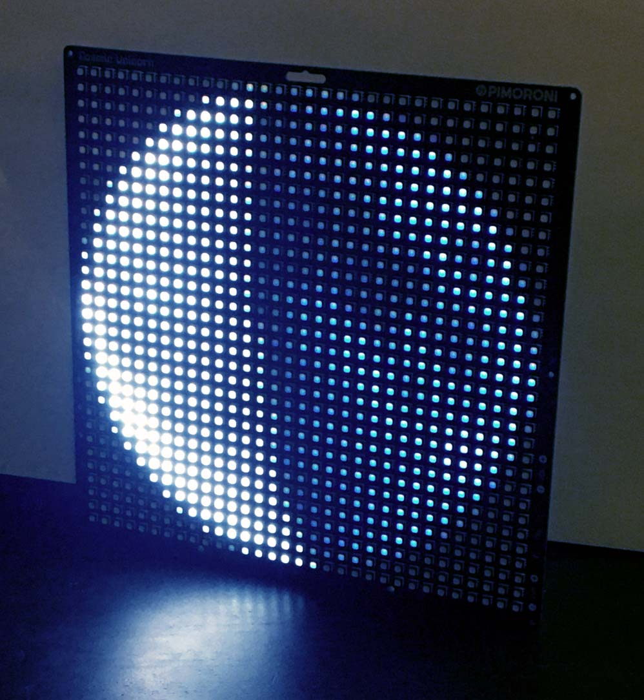

*moonPhase*

Accurate Moon Phase display for Cosmic Unicorn!  
2024 By Patrick Hennessey

### Info

Connects to your WiFi network to get Unix time in order to generate correct moon phase  
Formula adapted from post: https://community.facer.io/t/moon-phase-formula-updated/35691/8

Formula starts at 0 and advances to 1, which is a full cycle.  
    0 = new moon, 0.5 = full moon, etc.

Image `0.png` should be a new moon image, middle image should be a full moon, etc.

Very acccurate moon images adapted from NASA's Scientific Visualization Studio:  
https://svs.gsfc.nasa.gov/5187

### Requirements

You'll need to create a "secrets.py" file with your wifi name and password, formatted as follows:

    WIFI_SSID = "WIFI NAME"
    WIFI_PASSWORD = "WIFI PASSWORD"

### Versions

main.py: basic moon phase display  
mainAnimated.py: animated version, pressing the A button on the Cosmic Unicorn toggles the animation

